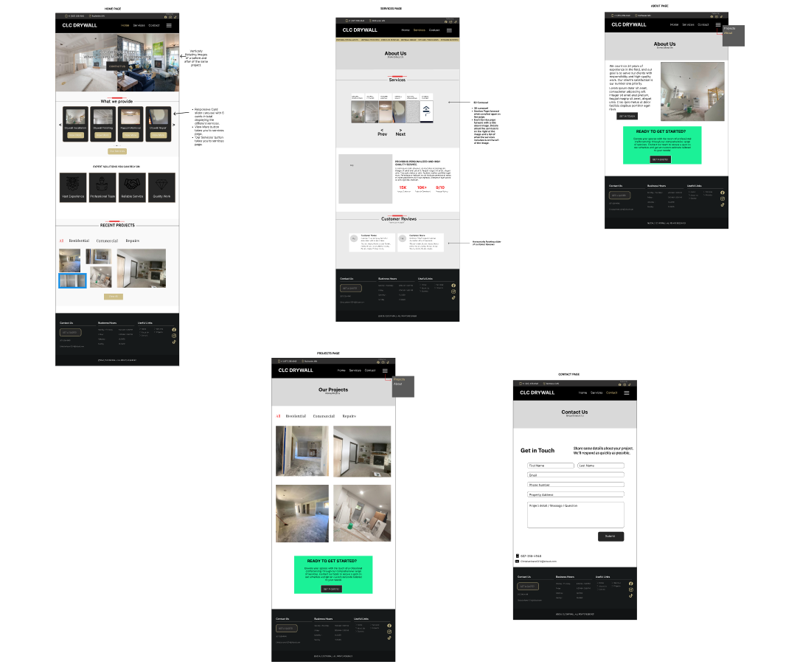
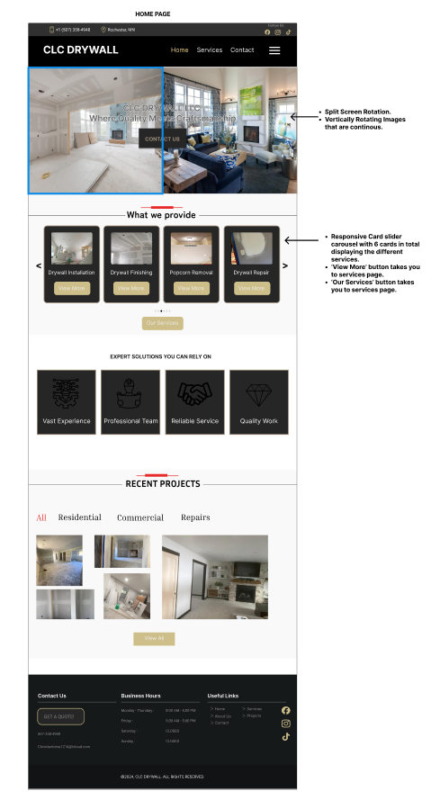
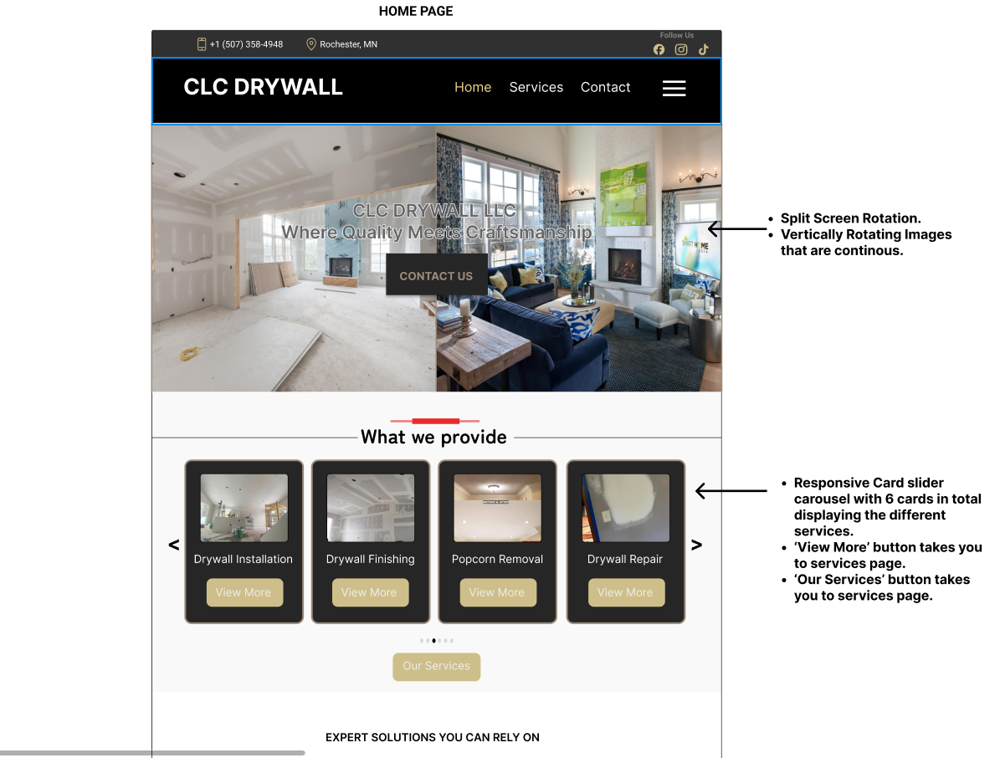
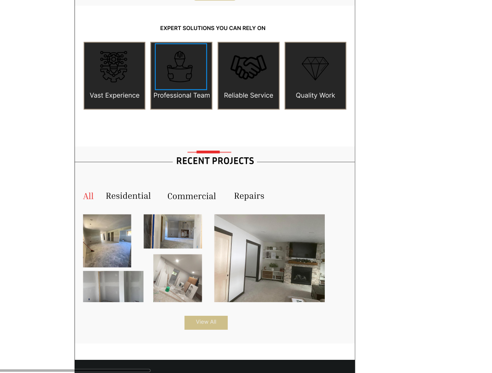
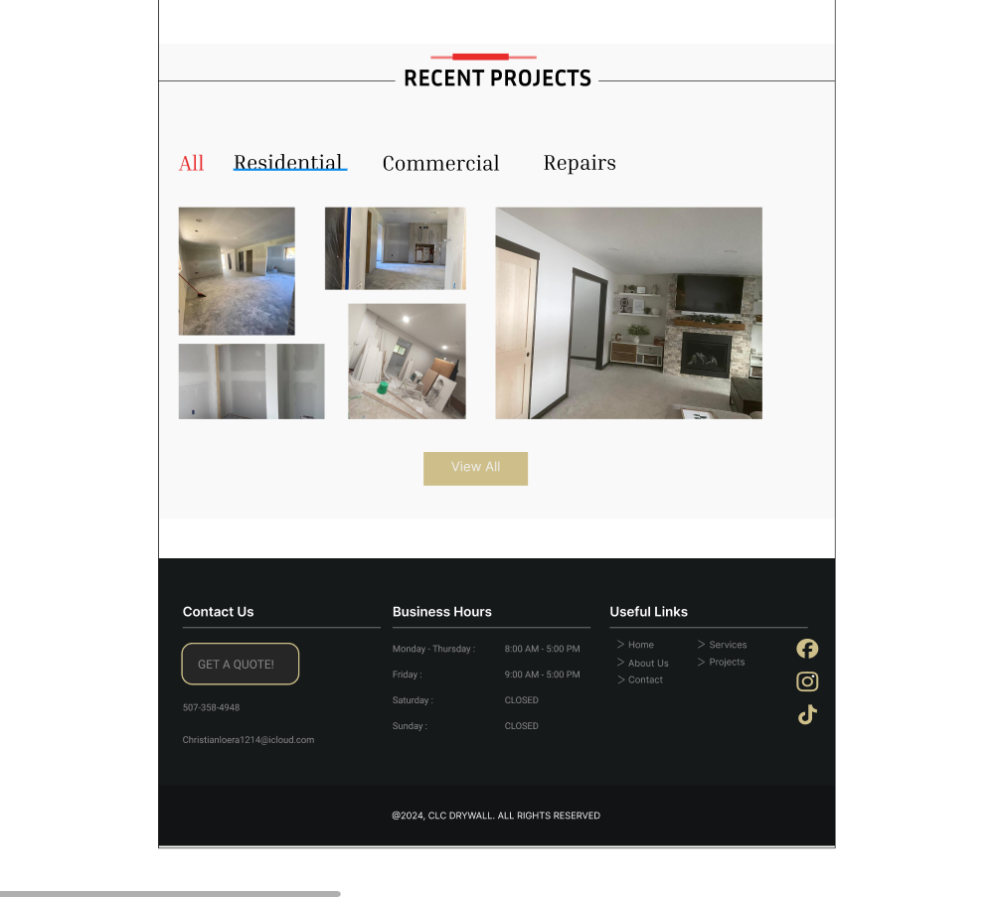
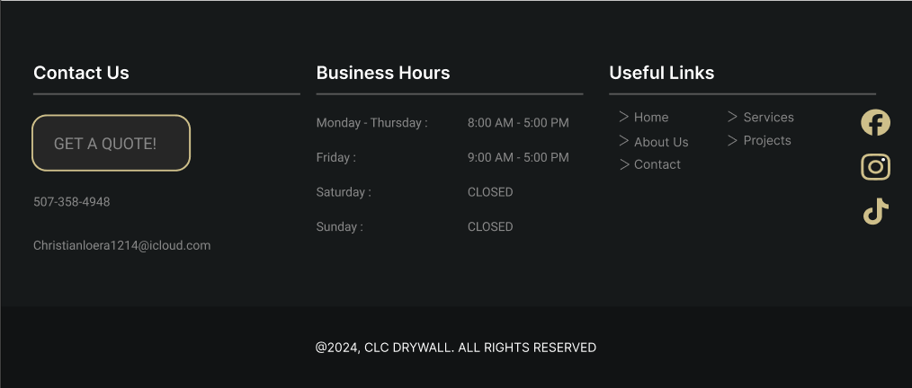
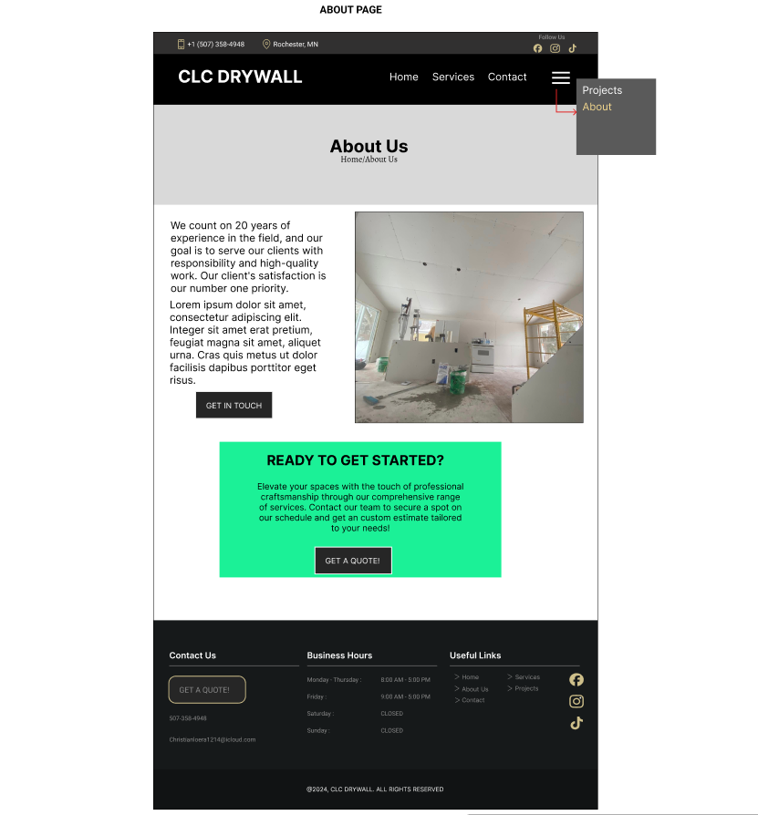
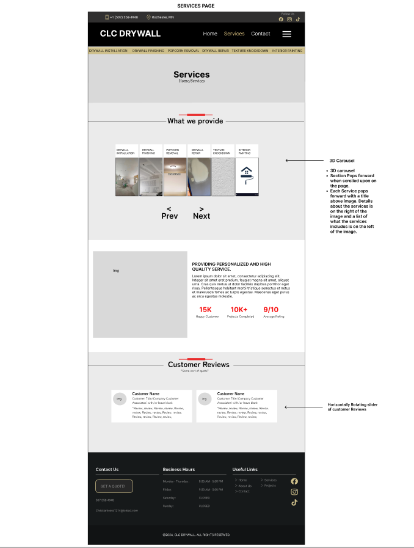
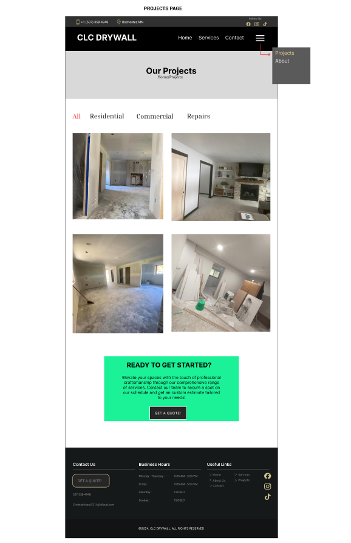
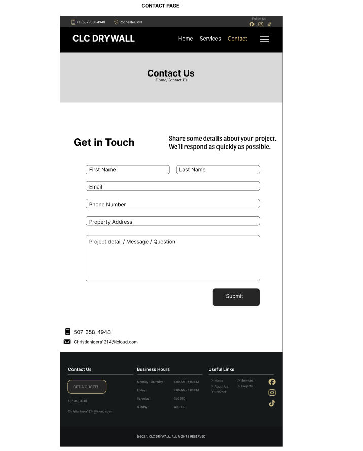

# Project Name: CLC DRYWALL 

## Description:
This web application acts as a dynamic digital presence for CLC DRYWALL. Based out of Rochester, MN CLC DRYWALL specializes in drywall services and interior painting. Crafted to reflect the company's unwavering commitment to excellence and customer satisfaction, this platform significantly boosts business visibility, fosters customer engagement, and simplifies the inquiry and quotation processes. It features an overview of the services provided, a portfolio showcasing the company's previous projects, detailed company information, customer testimonials with a feedback option, and straightforward contact methods. Beyond enhancing CLC DRYWALL's digital footprint, the application provides potential clients with a comprehensive, accessible, and user-friendly avenue to discover, engage with, and benefit from the services CLC DRYWALL offers.

## Project Duration: Ongoing

## Design
- Figma- Application Flowcharting and wireframes
- Google Docs - Scope documentation 


## Features:
- Service Information 
- Company Information 
- Portfolio Display 
- Easy contact options: With Primary and secondary call to action. 
- Customer Testimonials and Reviews 

## Design Wireframes

<p align-items="center">
Figma design of all webpages


Landing Page - Full Web Page


Landing Page - Nav/Hero/content


Landing Page - Content


Landing Page - Content


Landing Page - Footer


About Page - Full Web Page


Services Page - Full Web Page


Projects Page - Full Web Page


Contact Page - Full Web Page

</p>


## Technologies Used: 
- JavaScript
- TypeScript 
- React
- CSS
- HTML 
- Next.js 14 react framework


## Dependencies installed: 
- npm install 
- npm install normalize.css
- npm install @mui/material @emotion/react @emotion/styled   -- optional (for later use)
- npm i bootstrap
- npm install boxicons --save
- npm install swiper
- npm install hamburgers


## Setup Insturctins: 
- Fork repo 
- git clone to local computer
- `cd " "` into project directory. 
- code . - open the project 
- run `npm install` 
- run `npm run dev`


## Acknowledgement
- CLC DRYWALL CLIENT

This is a [Next.js](https://nextjs.org/) project bootstrapped with [`create-next-app`](https://github.com/vercel/next.js/tree/canary/packages/create-next-app).

## Getting Started

First, run the development server:

```bash
npm run dev
# or
yarn dev
# or
pnpm dev
# or
bun dev
```

Open [http://localhost:3000](http://localhost:3000) with your browser to see the result.

You can start editing the page by modifying `app/page.tsx`. The page auto-updates as you edit the file.

This project uses [`next/font`](https://nextjs.org/docs/basic-features/font-optimization) to automatically optimize and load Inter, a custom Google Font.

## Learn More

To learn more about Next.js, take a look at the following resources:

- [Next.js Documentation](https://nextjs.org/docs) - learn about Next.js features and API.
- [Learn Next.js](https://nextjs.org/learn) - an interactive Next.js tutorial.

You can check out [the Next.js GitHub repository](https://github.com/vercel/next.js/) - your feedback and contributions are welcome!

## Deploy on Vercel

The easiest way to deploy your Next.js app is to use the [Vercel Platform](https://vercel.com/new?utm_medium=default-template&filter=next.js&utm_source=create-next-app&utm_campaign=create-next-app-readme) from the creators of Next.js.

Check out our [Next.js deployment documentation](https://nextjs.org/docs/deployment) for more details.
